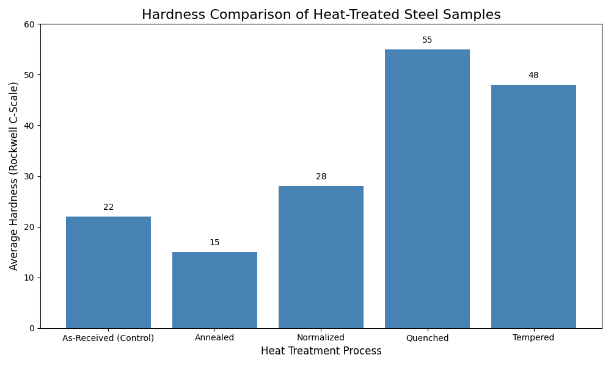

# Analysis of Heat Treatment Effects on Medium Carbon Steel

### Project by: Khan Sahid

---

## 📋 Abstract

This project investigates the effects of four fundamental heat treatment processes—**annealing, normalizing, quenching, and tempering**—on the mechanical properties and microstructure of a medium carbon steel. Samples were subjected to controlled thermal cycles, and the resulting changes were quantified using **Rockwell hardness testing** and analyzed through **optical microscopy**. The results demonstrate a strong correlation between the cooling rate, the resulting phase transformation, and the material's final hardness.



---

## 🔬 Methodology

1.  **Material:** Five identical samples of AISI 1045 medium carbon steel.
2.  **Austenitizing:** All samples (except the control) were heated to **850°C** and held for 1 hour.
3.  **Cooling Cycles:**
    * **Annealing:** Slow furnace cool.
    * **Normalizing:** Cooled in still air.
    * **Quenching:** Rapidly cooled in a water bath.
    * **Tempering:** The quenched sample was reheated to 450°C for 1 hour.
4.  **Analysis:** Hardness was measured using the Rockwell C-scale (HRC), and microstructures were examined using an optical microscope after standard metallographic preparation.

---

## 📊 Results

### Hardness Measurements

The heat treatments produced a wide range of hardness values, clearly demonstrating the ability to tailor the material's properties.

| Sample Treatment      | Average Hardness (HRC) |
| --------------------- | ---------------------- |
| As-Received (Control) | 22                     |
| Annealed              | 15                     |
| Normalized            | 28                     |
| Quenched              | 55                     |
| Tempered              | 48                     |

### Microstructural Analysis

The observed microstructures provide a clear explanation for the measured hardness values.

| As-Received (Ferrite + Pearlite) | Annealed (Coarse Pearlite) |
| :------------------------------: | :------------------------: |
|  |  |
| **Normalized (Fine Pearlite)** | **Quenched (Martensite)** |
|  |  |
| **Tempered (Tempered Martensite)** |                            |
|  |                            |


---

## 結論 Conclusion

This experiment successfully confirmed that the mechanical properties of medium carbon steel are a direct function of its microstructure, which is controlled by the applied heat treatment. The rapid cooling during quenching formed a hard, strained martensitic structure (55 HRC), while the slow cooling of annealing formed a soft, coarse pearlitic structure (15 HRC). This project serves as a practical demonstration of fundamental materials science principles.

---

## 🚀 Running the Analysis

To generate the hardness comparison chart from the raw data:

1.  Ensure you have Python, `pandas`, and `matplotlib` installed.
2.  Clone this repository.
3.  Run the following command in your terminal from the project's root directory:
    ```bash
    python analysis.py
    ```
4.  This will generate the `hardness_comparison_chart.png` file.